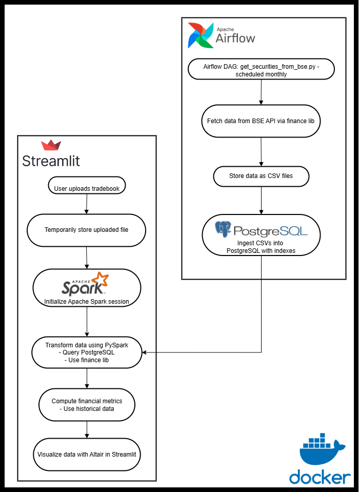

# Architecture Overview

Portfolio Analyzer is a web application built with Streamlit. It integrates Apache Airflow for orchestration, PostgreSQL for storage and Apache Spark for data processing. The system processes uploaded tradebook data, fetches and integrates securities data, applies corporate action adjustments, and delivers interactive financial insights. The entire application is containerized using Docker and Docker Compose for portability and ease of deployment.

## Key Components:

1. **Frontend**: Streamlit Application for data upload and visualization.
2. **Backend**: Apache Spark for distributed data processing and analysis.
3. **Orchestration**: Apache Airflow for task orchestration of data ingestion.
4. **Storage**: PostgreSQL for persistent storage of securities information fetched from BSE.
5. **Messaging**: Redis for enabling distributed task execution within Apache Airflow.
6. **Finance Library**: Custom library ([hosted on GitHub](https://github.com/ninja-con-gafas/finance)) for domain-specific financial data retrieval.
7. **Containerization**: Docker and Docker Compose for packaging and deploying the application.

## Design Principles:

- **Modular Architecture**: Different parts of the system (data processing, data ingestion and data visualization) are decoupled for better maintainability and scalability.
- **Computational Scalability**: Leverages Apache Spark for efficient handling of computationally intensive tasks, especially those involving stateful and row-interdependent operations.
- **Data Integration**: Integrates with external sources like BSE for securities data, enhancing the analysis capabilities.
- **Resilience**: Built using tools that provide fault tolerance (Apache Airflow, PySpark).
- **Portability**: Containerized using Docker for easy deployment across different environments.

# Component Breakdown

This section describes the various components of the Portfolio Analyzer and their responsibilities.

## 1. Frontend: Streamlit Application
- **Role**: User interface for data upload, broker selection, and visualization of portfolio insights.
- **Responsibilities**:
    - **[Home Page](../pages/Home.py)**:
        - Allows users to upload tradebook files.
        - Enables users to select brokers and segments.
        - Initializes the Apache Spark session for backend processing.
        - Redirects users to the Holdings page after tradebook processing.
    - **[Holdings Page](../pages/Holdings.py)**:
        - Displays interactive visualizations of portfolio holdings and valuation trends.
        - Generates charts using Altair for holdings over time, valuation trends, and the latest holdings pattern.
    - **UI Configuration**:
        - Sidebar navigation managed via [`ui_components.py`](../config/ui_components.py).
        - Streamlit configuration managed through [`config.toml`](../.streamlit/config.toml).

## 2. Backend: Data Processing and Analysis
- **Role**: Engine for processing tradebooks, fetching historical data, adjusting for corporate actions, and performing portfolio analysis. Built on Apache Spark for distributed processing.
- **Components**:
    - **2.1. [Equity Analysis](../process/Equity.py)**:
        - **Tradebook Processing**: Loads and cleans tradebook data from CSV files.
        - **Corporate Action Adjustment**: Adjusts trade quantities based on stock splits and bonuses.
        - **Historical Data Integration**: Fetches historical stock prices using the custom finance library.
        - **Portfolio Analysis**: Calculates holdings over time, portfolio tenure, and aggregated trades. Compiles quotes and generates valuation trends.
    - **2.2. [BSE Integration](../process/BSE.py)**:
        - Interacts with the Bombay Stock Exchange (BSE) to fetch securities data.
        - Queries PostgreSQL for script codes.
        - Uses the BSE API to fetch securities information for different segments.

## 3. Orchestration: Apache Airflow
- **Role**: Task orchestration engine to automate data ingestion.
- **Responsibilities**:
    - Manages and schedules tasks for fetching securities data from BSE.
    - **[DAG](../dags/get_securities_from_bse.py)**:
        - Drops the existing securities table in PostgreSQL.
        - Fetches securities data for different segments from the BSE API.
        - Saves the fetched data to CSV files.
        - Ingests the data from CSV files into the PostgreSQL database.
        - Creates indexes on the securities table for optimized querying.
    - Runs on a monthly schedule to keep securities data up-to-date.

## 4. Data Storage: PostgreSQL
- **Role**: Persistent storage for securities information fetched from BSE.
- **Responsibilities**:
    - Stores securities data fetched from BSE.
    - **Database Configuration**:
        - Connection properties managed via environment variables and accessed through [`database.py`](../config/database.py).
        - JDBC URLs used for Apache Spark-PostgreSQL integration.

## 5. Messaging: Redis
- **Role**: Message broker for Apache Airflow's CeleryExecutor, enabling distributed task execution.
- **Responsibilities**:
    - Facilitates communication and coordination between Apache Airflow scheduler and worker processes.
    - Ensures efficient handling of data ingestion across multiple workers.

## 6. Containerization: Docker and Docker Compose
- **Role**: Provides a platform for packaging and deploying the entire application as isolated containers.
- **Responsibilities**:
    - **Docker Services**:
        - Streamlit Application: Runs the frontend and backend logic.
        - Apache Airflow Scheduler: Manages DAG scheduling.
        - Apache Airflow Webserver: Provides a web interface for monitoring Apache Airflow.
        - Apache Airflow Worker: Executes Apache Airflow tasks.
        - PostgreSQL: Provides the database service.
        - Redis: Provides the message broker service.
    - **Networking**: All services connected via a custom Docker network (`portfolio-analyzer-network`) for secure inter-container communication.
    - **Build Automation**: `build.sh` script automates the creation of Docker images and configuration files.

## 7. Logging and Monitoring
- **Role**: Provides mechanisms for tracking application behavior and debugging issues.
- **Components**:
    - **StreamlitLogHandler**: Custom log handler that streams logs directly to the Streamlit UI, providing real-time feedback during data processing.

## 8. External Libraries and Dependencies
- **Role**: Leverages open-source libraries and a custom finance library to enhance functionality.
- **Dependencies**:
    - `matplotlib`: For basic plotting within Streamlit (though Altair is primarily used).
    - `pandas`: For data manipulation and analysis within Streamlit.
    - `psycopg2-binary`: PostgreSQL adapter for Python, used for database interactions.
    - `pyspark`: Apache Spark's Python API for distributed data processing.
    - `requests`: For making HTTP requests, used for API interactions.
    - `scipy`: Scientific computing library, for advanced calculations.
    - `setuptools`: For packaging and distributing Python projects.
    - `streamlit`: The frontend framework for building the user interface.
    - `git+https://github.com/ninja-con-gafas/finance.git`: [Custom finance library hosted on GitHub](https://github.com/ninja-con-gafas/finance).
        - **Securities Utilities**: Provides modules for retrieving and processing financial market data:
            - **Fetching Historical Data**: Retrieves historical stock prices from Yahoo Finance API with support for various frequencies and quote types.
            - **Fetching Corporate Events**: Retrieves corporate events (bonuses, dividends, stock splits) from BSE India API, allowing filtering by event type and date range.
            - **Fetching BSE Script Code**: Retrieves BSE Script Codes from BSE India API, supporting filtering by segment and status.

# Architecture Decision Records (ADRs)

## ADR-001: Use Streamlit for UI
- Chosen for its rapid development and low overhead.

## ADR-002: Use Apache Airflow for Orchestration
- Needed scheduling and retry logic for securities data from BSE.

## ADR-003: PostgreSQL for Storage
- Chosen for robustness and familiarity.

## ADR-004: Use of PySpark
- **Context**:  Despite a modest data volume, the workload is computationally heavy due to stateful row-wise dependencies and wide-form transformations applied over daily trade data.
- **Decision**: Adopt PySpark to leverage its parallel execution model, support for window functions, and transformation optimization.
- **Consequences**: Slightly steeper setup and infra requirement, but scalable and performant execution.
- **Rationale**: Chosen not for handling large-scale datasets, but for managing computational complexity. Even with ~3650 rows (10 years of daily trades), the wide-form transformation and row-interdependent calculations like rolling average buy price or adjusting for corporate actions introduce a heavy processing overhead. PySpark enables:
    - Declarative, optimized, and lazy-evaluated transformation pipelines.
    - Seamless execution of chained, stateful calculations via `Window` functions.
    - Superior utilization of multicore CPUs, even in local mode.

## ADR-005: Use of Custom Finance Library
- **Context**: Integration with specific APIs (BSE, Yahoo Finance) is required.
- **Decision**: Maintain a centralized finance library in GitHub and import it as a dependency.
- **Consequences**: More modular, DRY codebase with cleaner logic separation and dedicated API integrations.
- **Rationale**: Existing open-source libraries are either unmaintained or lack required API support. Inlining logic leads to duplication and poor testability. A custom module encapsulates logic for fetching historical data, script codes and corporate events from specific APIs.

# Data Flow

The system has two primary data pipelines: **User Interaction Flow** and **Airflow-Orchestrated Flow**. These operate semi-independently as the former is dependent on the later.

## User Interaction Flow (Streamlit-Driven):

1. **User uploads tradebook**: The user uploads a long-form tradebook file via the Streamlit frontend. The user also selects the broker and segment.
2. **Temporary storage**: The uploaded file is temporarily stored in a staging area for processing.
3. **Apache Spark session initialization**: When a user uploads a tradebook, the Streamlit application initializes a Apache Spark job.
4. **Data transformation**: PySpark processes the uploaded tradebook data into a wide-form table. This process involves querying PostgreSQL for securities data and using the finance library for corporate action adjustments and historical data.
5. **Financial metrics calculation**: PySpark jobs to compute financial metrics. Historical data fetched by the finance library is used in these calculations.
6. **Visualization**: The Streamlit application retrieves the processed data from Apache Spark (using Pandas for intermediate manipulation) and visualizes the holdings and other metrics using Altair charts.

## Airflow-Orchestrated Flow (Backend Data Refresh):

1. **Apache Airflow DAG execution (Securities Data)**: On a monthly schedule, the [`get_securities_from_bse.py`](../dags/get_securities_from_bse.py) DAG in Apache Airflow is executed.
2. **Fetch BSE data**: The DAG fetches securities data for different segments from the BSE API using the finance library.
3. **Store BSE data**: The fetched securities data is stored in CSV files and then ingested into the PostgreSQL database. Indexes are created for optimized querying.

